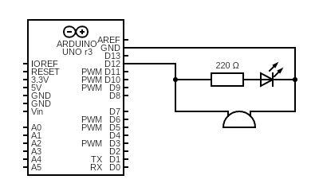

#### Description

The **Morse code encoder** is a small simple project. It's purpose is transforming words or sentences that use the English alphabet and digits, into Morse code signals, outputted as buzzer sound and LED flashes. Both are connected in parallel to **pulsePin** (12 by default). Due to the nature of the project, right now it's heavier on the code side than physical circuit side. Right now the speed of displaying Morse code is hard coded to 50ms (or multiple of that, depending on what is displayed).

#### Future improvements

I plan to integrate an LCD display to show vital info to the user. Also, the abilty to make the speed of encoding customizable by the user. A membrane switch panel might come in handy in this application.