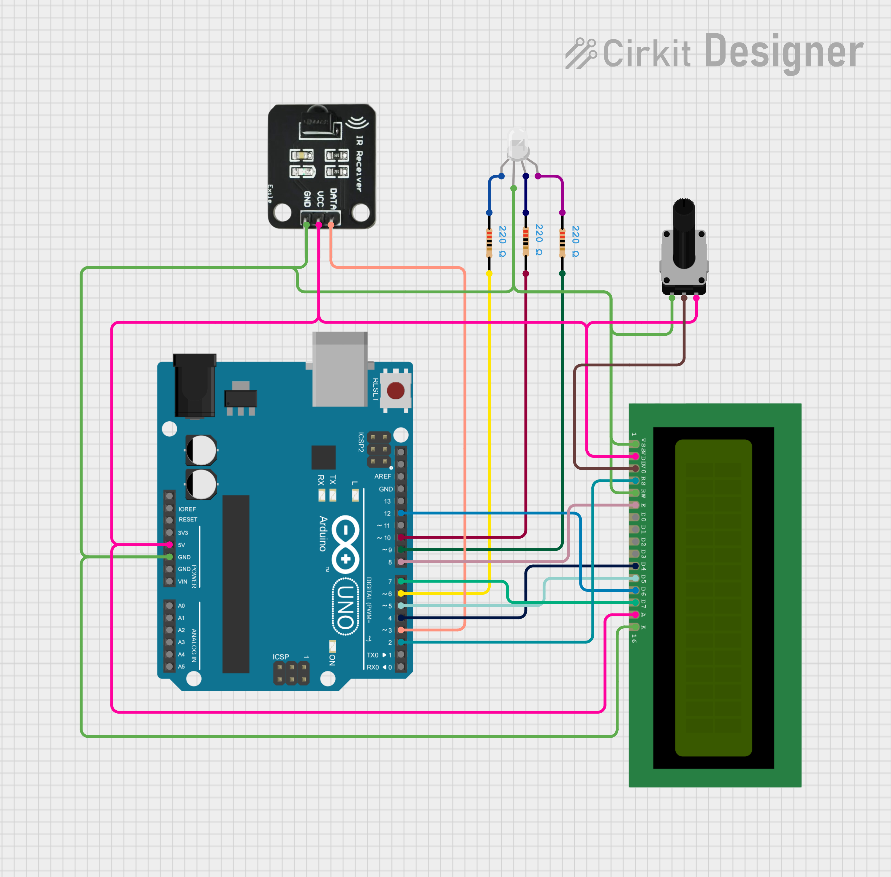

### Infrared Controlled RGB LED

A simple project that was meant to introduce me into the infrared remote and receiver capabilities and how to use them. The project is pretty simple as it only contains 7 predefined colors and brightness alteration. You can use the remote to set a mood in your room without having to stand up from your chair or bed.

The build is fully capable of being powered by an external power source instead of being constantly hooked up to a computer, after downloading the source code into the board.

You can see the schematic in greater detail here:
[Schematic](https://app.cirkitdesigner.com/project/d2f0a856-8f55-4d22-b280-66e3a1fede4c)

#### Components

The circuit was built on a breadboard but excluding it the components used are:
- Arduino UNO R3 (could be replaced with Arduino Nano or ESP32 for a more compact build)
- ELEGOO Infrared Remote
- Infrared Receiver
- 16x2 LCD display
- RGB LED with a common cathode
- 220Ω resistor (3x)
- Rotary potentiometer

**Note:** After setting a nice-looking contrast with the poteniometer, I measured current voltage on that point and then replaced the potentiometer with a voltage divider that supplied constant voltage of desired value.
That value in my case was about 1.15V. I used 330Ω as $Z_1$ and 100Ω as $Z_2$, as the Arduino supplies 5V.

Image By Velociostrich - Own work, CC BY-SA 3.0, https://commons.wikimedia.org/w/index.php?curid=7765066

#### Known Bugs

- The remote might react a couple of times when pressing a button for slightly too long. A delay might be needed to reduce that. Ideally, the delay should be applied, but omitted when a button is being held deliberately.