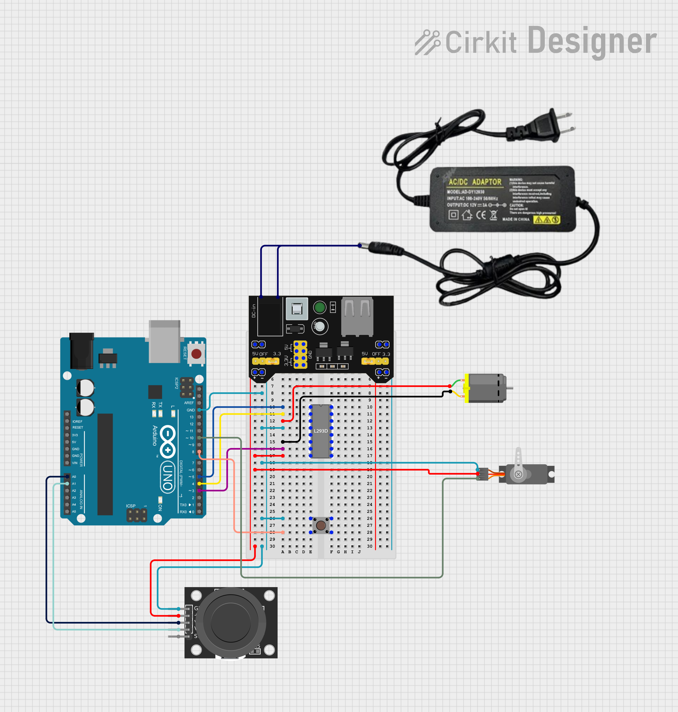

### Joystick Fan

This is a random idea that occured to me late at night. I just started coding and building without much thought. It's basically a fan with controllable speed and direction, you also can turn it off with a button (this does not turn off direction control). Speed and direction are controlled with joystick. The fan can change direction in 180 degree angle.

**Most likely, nothing will be added to this project in the future. As of now I don't have any ideas how to improve it, nor what to add to make it better.**

##### Components

Excluding the breadboard and its power supply, the project uses the following components:
- Arduino Uno R3 - Used for controlling everything and managing the joystick logic
- Joystick module - Main source of control in the system
- Pushbutton - Used for turning the fan on/off
- L293D motor driver - Communication medium between Arduino and DC motor
- Servo MG-90S - Sets the position of where the fan is blowing
- DC motor - The fan is mounted on it's moving shaft

##### Notes
While supplying the power through the power supply outputting 5V, and Arduino being connected to PC with USB cable, everything is working great.
I wanted to connect Vin pin on Arduino to the breadboards power rail, without connecting to PC. When I do that, servo turns but instantly return to position 0 when letting go off joystick. Motor doesn't run at all.
I suppose this is because of too small current supply by the power supply, but I might have to explore this further.